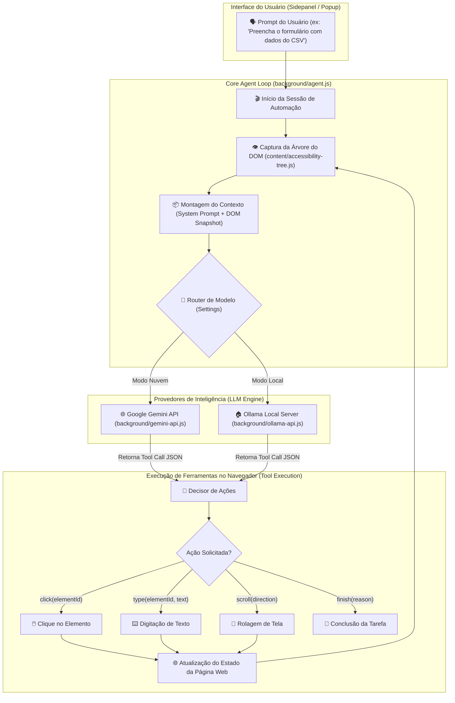

<div align="center">
  <h1>🤖 Nano Web Agent — AI Browser Automation Engine</h1>
  <p><b>Agente Autônomo para Navegadores Web baseado em LLMs (Google Gemini API & Ollama Local AI)</b></p>

  <p align="center">
    
    
    
    
    
  </p>
</div>

---

> [!CAUTION]
> **TERMOS DE LICENCIAMENTO E USO COMERCIAL**
> 
> O **Nano Web Agent** é um software de automação avançado e proprietário desenvolvido por **Eduardo Junior Alcântara da Silva**.
> - 🎓 **Uso Pessoal & Acadêmico:** 100% Gratuito, exigindo a devida **atribuição de autoria** e link para este repositório.
> - 💼 **Uso Comercial & Lucrativo:** **Estritamente proibido** utilizar este código em soluções pagas, SaaS ou serviços comerciais sem autorização prévia por escrito e pagamento de comissões/royalties. Leia o arquivo [`LICENSE.md`](file:///LICENSE.md).

---

## 📌 Visão Geral do Sistema

Inspirado nos avanços de agentes autônomos para sistemas operacionais e navegadores (como o *Claude Computer Use*), o **Nano Web Agent** é uma extensão de navegação de nível profissional que transforma Modelos de Linguagem (LLMs) em **operadores de navegador ativos**.

Diferente de simples chatbots que apenas respondem texto, o **Nano Web Agent** possui "olhos e mãos" dentro do navegador:
1. **Ele enxerga:** Converte a página web ativa em uma árvore de acessibilidade simplificada (Accessibility Tree / DOM Tree).
2. **Ele pensa:** Envia o estado atual da tela + a meta do usuário para o LLM (Gemini ou Ollama) e recebe chamadas de ferramentas de volta (Tool Calls).
3. **Ele age:** Injeta ações reais de teclado, cliques de mouse, seleção de formulários e rolagem diretamente na aba do navegador.
4. **Ele avalia:** Observa a reação da página pós-ação e continua o loop até cumprir o objetivo.

---

## 🏗️ Arquitetura Interna & Ciclo do Agente Autônomo

O sistema foi desenhado para ser resiliente, assíncrono e agnóstico a provedores de IA.



---

## 🌟 Funcionalidades e Diferenciais Técnicos

### 1. 🔀 Provedor Multi-LLM (Cloud Gemini & Ollama Local)
- **Google Gemini API:** Integração direta com a API do Gemini Flash/Pro para raciocínio complexo.
- **Ollama Local AI:** Permite conectar modelos locais (como **Llama 3, Gemma, Mistral, Qwen**) rodando na porta `http://localhost:11434`. Inclui regras automáticas de bypass de CORS (`rules/ollama-cors.json`) no Chrome.

### 2. 👁️ Extração Eficiente da Árvore de Acessibilidade (`content/accessibility-tree.js`)
Em vez de gastar milhares de tokens enviando capturas de tela gigantescas em imagem (Vision), a extensão extrai uma árvore de acessibilidade enxuta em JSON contendo apenas elementos interativos (`button`, `input`, `a`, `select`, `textarea`), atribuindo IDs numéricos temporários (`[12]`, `[15]`). Isso garante:
- Respostas até **10x mais rápidas**.
- Redução brutal no consumo de tokens da API.
- Funcionamento perfeito em máquinas com hardware modesto usando Ollama.

### 3. 🕹️ Conjunto de Ferramentas de Automação (`background/browser-tools.js`)
O agente possui as seguintes ferramentas declaradas nativamente para a IA:
- `click_element(id)`: Executa o evento de clique no elemento selecionado.
- `type_text(id, text)`: Foca e digita o texto especificado.
- `scroll_page(direction)`: Rola a página para cima (`up`) ou para baixo (`down`).
- `wait_for(ms)`: Aguarda carregamentos dinâmicos ou elementos AJAX.
- `finish_task(summary)`: Encerra o loop e apresenta o relatório final ao usuário.

### 4. 🎨 Indicador Visual de Agente Ativo (`content/agent-indicator.js`)
Durante a execução autônoma, uma barra de status discreta é injetada no topo da página informando ao usuário qual ação o agente está realizando em tempo real (ex: `"Agente digitando no campo [14]..."`), permitindo interrupção manual a qualquer segundo.

---

## 📂 Estrutura de Código-Fonte do Repositório

```
nano-web-agent/
├── src/                          # Código-fonte da Extensão Chrome (Manifest V3)
│   ├── background/               # Service Worker e Motor do Agente
│   │   ├── agent.js              # Loop principal de controle (Perceber -> Planejar -> Agir)
│   │   ├── browser-tools.js      # Declaração e execução das ferramentas de automação
│   │   ├── debugger.js           # Integração com Chrome Debugger Protocol (CDP)
│   │   ├── gemini-api.js         # Cliente da API do Google Gemini (Nuvem)
│   │   ├── ollama-api.js         # Cliente HTTP para servidor local Ollama
│   │   └── settings.js           # Gerenciador de armazenamento local da extensão
│   ├── content/                  # Scripts injetados nas abas abertas
│   │   ├── accessibility-tree.js # Parser de DOM e construtor da árvore de acessibilidade
│   │   └── agent-indicator.js    # Overlay visual de status do agente
│   ├── icons/                    # Ícones oficiais da extensão
│   ├── rules/                    # Regras DeclarativeNetRequest
│   │   └── ollama-cors.json      # Regra de desvio de CORS para Ollama Local
│   ├── background.js             # Entrypoint do Service Worker
│   ├── manifest.json             # Manifesto V3 com permissões e scripts
│   ├── popup.html / popup.js     # Interface rápida de acionamento
│   ├── settings.html / .js       # Painel de configurações (API Keys, Endpoints, System Prompts)
│   └── sidepanel.html / .js      # Interface gráfica lateral para chat e comando do agente
├── LICENSE.md                    # Termos de Licença de Uso
└── README.md                     # Esta documentação detalhada
```

---

## 🛠️ Como Instalar e Executar

1. **Clonar este repositório:**
   ```bash
   git clone https://github.com/Eduardo00073/nano-web-agent.git
   ```

2. **Carregar no Navegador (Chrome / Edge / Brave):**
   - Acesse a página `chrome://extensions/`
   - Ative a opção **Modo do Desenvolvedor** no canto superior direito.
   - Clique no botão **Carregar sem compactação** (Load unpacked).
   - Selecione a pasta `src/` localizada dentro do repositório clonado.

3. **Configurar o Provedor de IA:**
   - Clique no ícone da extensão e abra as **Configurações**.
   - **Para Google Gemini:** Insira sua API Key obtida no [Google AI Studio](https://aistudio.google.com/).
   - **Para Ollama Local:** Instale o [Ollama](https://ollama.com/), rode um modelo no terminal (`ollama run llama3`) e mantenha a URL `http://localhost:11434`.

4. **Operar o Agente:**
   - Abra qualquer site (ex: um formulário ou painel de dados).
   - Abra o **Sidepanel** da extensão no canto lateral do navegador.
   - Digite a instrução desejada (ex: *"Preencha o formulário com dados de exemplo e clique em Enviar"*) e assista a automação em tempo real!

---

## 📄 Licenciamento e Contato Comercial

Este projeto está protegido por **Licença de Atribuição Pessoal/Acadêmica com Restrição Comercial**:
- **Permitido:** Estudos, pesquisas acadêmicas e projetos pessoais não monetizados.
- **Proibido:** Revenda, comercialização em SaaS ou uso em sistemas corporativos com intuito lucrativo sem licença comercial autorizada.

Para propostas comerciais ou customização sob medida:
- 📧 **Website:** [www.prof-eduardo.com](https://www.prof-eduardo.com/)
- 💼 **LinkedIn:** [linkedin.com/in/edu7](https://www.linkedin.com/in/edu7/)

---

<div align="center">
  <p>© 2026 Eduardo Junior Alcântara da Silva. Todos os direitos reservados.</p>
</div>
